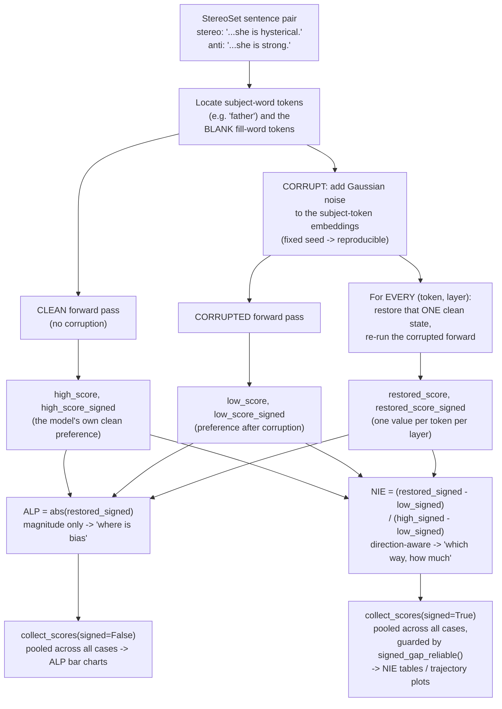
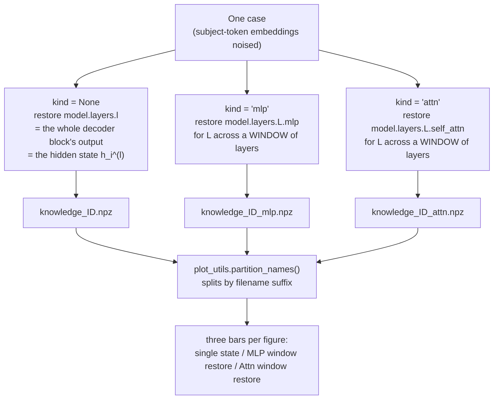
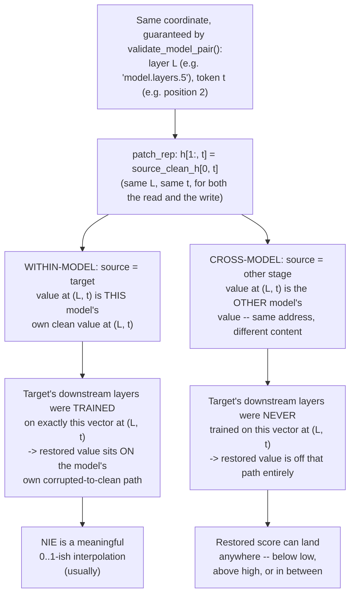

# Pipeline State — Signed NIE, Cross-Model Anchoring, and What's Safe to Claim

**Date:** 2026-09-11. **Scope:** `experiments/bias_trace.py`, `plot_utils.py`, `fig.py`,
`scripts/table.py`, as of commit `bbad255` on `main`. Written for a reader who has
never seen this pipeline before: what it computes, why, what changed this session,
what's safe to put in the paper, and where the sharp edges are — with real numbers
from actual runs, not invented ones, except where explicitly marked "illustrative."

---

## 0. The whole pipeline, in one picture



Everything below fills in the boxes with real numbers and explains the two places
(`H`→`I` for cross-model, and the `K`/`M` pooling step) where the picture above hides
a real problem.

### 0.1 Box `H` is really *three* runs — single state, MLP window, Attn window

Box `H` above says "restore that ONE clean state". That is only the first of **three
separate passes** the pipeline makes over every case (`bias_trace.py`, `for kind in None,
"mlp", "attn"`). Each pass restores a *different kind of thing*, writes its own result
file, and becomes its own bar in the figures. They are never combined inside one run.



**What is actually hooked.** All three go through the same `trace_with_patch`; only the
module name differs (`layername(model, l, kind)`). On OLMo-2-1B:

| `kind` | module hooked | class | what gets overwritten |
|---|---|---|---|
| `None` | `model.layers.{l}` | `Olmo2DecoderLayer` | the block's whole output — the hidden state |
| `"mlp"` | `model.layers.{l}.mlp` | `Olmo2MLP` | only the MLP contribution `m_i^(l)` |
| `"attn"` | `model.layers.{l}.self_attn` | `Olmo2Attention` | only the attention contribution `a_i^(l)` |

In the residual stream `h^(l) = h^(l-1) + a^(l) + m^(l)`, the `mlp`/`attn` runs force **one
summand** to its clean value; the incoming residual `h^(l-1)` stays corrupted. So the
hidden state is never restored in those runs — it is only nudged, because one of the three
things that build it changed. The `kind=None` run is the opposite: it overwrites `h^(l)`
outright, which also replaces that layer's own attention and MLP contributions.

### 0.2 Why the MLP/Attn runs need a *window*

A single `m_i^(l)` is a small additive term in the residual stream, so restoring one on its
own barely moves the output — the effect is lost in the noise. ROME's fix, which we
inherited, is to restore **several consecutive layers at once** at the same token
(`trace_important_window`). The patch list for the cell at layer `l` is

```python
range(max(0, l - window // 2), min(num_layers, l - (-window // 2)))
```

so for `l = 8`, `window = 10`, 16 layers → layers **[3,4,5,6,7,8,9,10,11,12]**: ten module
outputs, all at **one** token position, restored simultaneously. Two properties worth
knowing:

- **It is off-centre when `window` is even** — five layers below `l`, `l` itself, four
  above. `main` now derives an odd default from depth (`2*(L//8)+1`), but every result file
  produced before that carries `window=10`, which the npz records.
- **Ten layers is 62 % of a 16-layer model.** ROME chose 10 for GPT-2 XL, where it is 21 %
  of 48 layers. The wider the window relative to depth, the closer "restore a window" gets
  to "restore most of that pathway", which is a limit on how *localized* any MLP/Attn claim
  from these bars can be.

**Real numbers**, same case as §2 (`knowledge_f6f70a1dfd48cf2694ecff300548492b`, base
OLMo-2-1B, tokens `['<|endoftext|>','My',' father',' is',' a',' emotional','.']`, subject
rows `[2,3]`, fill rows `[5,6]`, `high=0.7248`, `low=0.7226`):

| run | file | grid | peak \|ALP\| | at |
|---|---|---|---|---|
| single state | `…492b.npz` | `(7, 16)` | 0.9696 | token 4, layer 13 |
| MLP window | `…492b_mlp.npz` | `(7, 16)` | 1.0701 | token 4, layer 15 |
| Attn window | `…492b_attn.npz` | `(7, 16)` | 0.9225 | token 4, layer 9 |

Same grid shape, same token axis, different experiments — and note the peaks land at
different layers, which is the entire reason the three bars are plotted side by side.

### 0.3 What these bars are *not*

They are **restore** experiments: clean values are put back, and the score says how much
the model recovers. ROME's paper also runs a different experiment it calls **"severing"**
(§2.2 / Fig. 3): freeze a sublayer at its *corrupted* values while restoring a single
state, to test whether the effect *needs* that pathway. Upstream BiasEdit labelled its
window-restore bars "Effect with Attn/MLP severed", which is ROME's term for that other
experiment; `38cc18d` renamed ours to "MLP/Attn window restore" (and fixed a bar↔file swap
of our own). Severing was explored in `3d00194` and reverted in `3bed2ca` — no severing
code remains, so no figure here may use the word "severed".

---

## 1. Two metrics — keep them separate in your head and in the writing

Every result file carries two independent readings of the same forward passes.

| | **ALP** (Absolute Log-Prob Diff) | **NIE** (Normalized Indirect Effect) |
|---|---|---|
| Question it answers | *Where does bias exist* — magnitude only | *How much does restoring/corrupting a state move the model's own preference* — direction matters |
| Chain | `scores` / `high_score` / `low_score` — **absolute value** | `scores_signed` / `high_score_signed` / `low_score_signed` — **signed**, stereo-minus-anti |
| Formula | mean per-token log-prob diff, `abs()`'d | `(restored − low) / (high − low)`, all three on the signed chain |
| Where computed | `bias_trace.py`'s `causal_difference` (both chains, every case) | `plot_utils.normalized_indirect_effect(..., signed=True)` |
| Direction-aware? | No — a state that restores the anti-stereotype scores the same as one that restores the stereotype | Yes — that's the entire reason the signed chain exists |

**Why both exist, in one sentence for the paper:** ALP tells you the layer/token
*localizes* something; signed NIE tells you *whether restoring it pushes the model
toward or away from the stereotype it started with*. A layer can have high ALP and
near-zero signed NIE (it moves the score, but roughly as often toward the
anti-stereotype as the stereotype across cases) — that's not a contradiction, it's the
whole point of keeping the two separate.

---

## 2. Worked example 1 — within-model tracing on one real case

Real case, real numbers, from `results/allenai/OLMo-2-0425-1B/main/gender/causal_trace/cases/knowledge_f6f70a1dfd48cf2694ecff300548492b.npz` (base OLMo-2-0425-1B, no fine-tuning).

**The sentence pair** (`data/domain/gender.json`, template `"My father is a BLANK."`):
- anti-stereotype: *"My father is a **emotional**."*
- stereotype: *"My father is a **tough**."*
- subject = `"father"`

**Step 1 — tokenize and locate spans.** After the `<|endoftext|>` start marker OLMo
needs glued on, the anti sentence tokenizes to:

```
idx:    0                1     2        3     4    5           6
token: <|endoftext|>   My    father    is    a   emotional    .
```

Subject span = token **2** only (`corrupt_range_anti = [[2, 3]]`). BLANK span = token
**5** only (`blank_idxs_anti = [5, 6]`) — this is where "emotional"/"tough" sits.

**Step 2 — clean run.** Run the model normally on both sentences, score
`P(emotional | prefix)` vs `P(tough | prefix)` (same prefix, since only the last word
differs) via `causal_difference`. Result: `high_score = 0.7248`.

**Step 3 — corrupt.** Add Gaussian noise (fixed seed, scale = 3× the embedding std)
to token 2's embedding only, on 10 independently-noised copies of the sentence. Score
again: `low_score = 0.7226`.

Already worth pausing on: **`high − low = 0.0022`.** Corrupting "father"'s embedding
barely moved the stereo-vs-anti preference for this case at all — this real example
*is* one of the small-or-wrong-signed-gap cases discussed in §5. Nothing broke; this
is what the raw data actually looks like for a large fraction of cases (see §5 for the
population-level number).

**Step 4 — restoration sweep.** For every (token, layer) — 7 tokens × 16 layers = 112
cells — restore just that one clean hidden state into the corrupted run and re-score.
At layer 0, restoring token 2 (the subject) alone gives a score of **0.6728** — i.e.
*below* even the corrupted baseline (0.7226) for this particular cell, which given the
tiny gap above is unsurprising: with almost nothing to recover, single-cell noise
dominates. The full 16-layer row for the subject token:

```
L0     L1     L2     L3     L4     L5     L6     L7     L8     L9     L10    L11    L12    L13    L14    L15
0.673  0.642  0.708  0.783  0.778  0.723  0.701  0.681  0.684  0.695  0.672  0.699  0.657  0.654  0.714  0.723
```

**Step 5 — aggregate.** `collect_scores` pools this row together with the equivalent
row from every other case in the domain (681 cases for OLMo gender), then divides by
the *pooled* `high − low` to get the plotted NIE curve — see §7 for why that pooling
step, applied to the signed chain, needs the `signed_gap_reliable()` guard from §6.

---

## 3. Worked example 2 — the cross-model anchoring problem, same underlying sentence

Different script (`verification/cross_model_scale_probe.py`, a diagnostic probe run
this session — not the main pipeline, and run with its own noise/sample settings, so
the numbers below don't numerically match §2's) but the same case id, so it's the same
real "My father is a ___" sentence pair. Direction: `pre_to_post` = base model's clean
activations spliced into the instruct model's corrupted run.

```
high      = 1.0827   (instruct model's own clean score)
low       = 0.3466   (instruct model's own corrupted score)
gap       = high - low = 0.7361     <- healthy, nowhere near degenerate
self_all  = 1.0827   (restore EVERY state from the instruct model's OWN clean run)
cross_all = 0.1187   (restore EVERY state from the BASE model's clean run instead)
```

**`self_all == high` exactly** (to float32 rounding) — if you hand the instruct model
back its own clean activations, it reconstructs its own clean answer perfectly. This
proves the *splicing mechanism* is correct: `trace_with_patch` does exactly what it
says.

**`cross_all` is not between `low` and `high`.** Compute where it falls on the
`[low, high]` scale, same way NIE would:

```
fraction = (cross_all - low) / gap = (0.1187 - 0.3466) / 0.7361 = -0.31
```

Handing the instruct model the *base* model's clean activations doesn't produce a
weaker version of recovery — it produces a score **31% of a full gap-width below the
corrupted baseline itself**. The denominator here (0.7361) is completely healthy; the
problem is entirely that `cross_all` isn't a value the instruct model's own
corrupted→clean journey would ever produce. See §8 for why, and for the full
distribution (this one case is not an outlier in isolation — it's typical of the
whole probe).

---

## 4. Within-model vs. cross-model, side by side

**The coordinate (which layer, which token) is exactly maintained in both cases —
this is not what breaks.** `patch_rep`'s actual patching line
(`experiments/bias_trace.py:494`) is:

```python
h[1:, t] = source_clean_h[0, t]
```

The same `layer` string (e.g. `"model.layers.5"`) and the same integer `t` (a token
position) are used to both *read* the clean value out of the source and *write* it
into the target — nothing shifts or re-indexes. That's only valid because
`validate_model_pair()` (run once, before any patching starts) already enforced: same
layer count and hidden size (so `"model.layers.5"` is the same structural position in
both models), and identical tokenizer plus identical token ids on a probe sentence
(so token index `t` is the same word in both models' sequences). Given that, "same
address" is guaranteed by construction, in both the within-model and cross-model case
alike.

**What differs is only what's *stored* at that identical address:**



Same architecture (`validate_model_pair`'s checks) guarantees the *address* lines up
— the patch runs without a tensor error, at exactly the right layer and token. It
says nothing about whether the two models' internal representations *mean* the same
thing once you're standing at that address. §3's probe is base ↔ instruct of the
*same* model family — the closest two checkpoints can be, sharing the same
architecture and tokenizer this whole guarantee rests on — and the mismatch still
shows up.

---

## 5. What you can say in the paper now, and how

### Within-model localization (ALP + signed NIE)
Mechanically sound — verified end to end (batch convention, noise reproducibility,
patch direction, hook mechanics; see §2's worked example for the mechanism in full).
Safe to report **with two caveats you should state explicitly, not bury**:

- The corruption effect is often small or the wrong sign: on the same real OLMo-2-1B
  gender data as §2 (n=681 cases), median `high − low` gap is **0.046**, and **38.6%**
  of cases have a non-positive gap — like §2's own example, corruption didn't reduce
  the stereo/anti separation, or increased it. Measured directly from the `.npz`
  files this session, matching `review.md` B2.
- A plausible, currently untested explanation is dilution: the reported score
  averages over the *whole sentence* (§2's example: 6 scoreable tokens for a 1-word
  fill), so a 1–2 token fill word is diluted across a much longer context
  (`review.md` B3, `UNEQUAL_LENGTH_PROBLEM.md`). The blank-only chain (`scores_blank`,
  `high_score_blank`, `low_score_blank`) already exists in every result file
  specifically to test this, and has never been run as a check. **This is the
  cheapest experiment that would tell you whether the small-gap problem is a metric
  artifact or a real, weaker finding — do this before writing the localization
  section, not after.**

### Cross-model patching (base ↔ instruct)
**Do not report cross-model NIE as a ratio, percentage, or mean/median "recovery"
number.** §3 and §8 show why: the fraction lands inside `[0,1]` only 33.3%
(base→instruct) / 8.3% (instruct→base) of the time, with individual cases 20–28× the
gap-width outside that range in both directions, and the mean of the 12 base→instruct
cases flips from −1.00 to +1.44 if you drop a single outlier — not a stable summary
of anything.

**What this is good evidence for, and how to phrase it:** not "bias information
transfers incompletely between training stages" (implies a measurable *degree*, which
would mean values attenuated toward zero but still bounded in `[0,1]` — not what's
observed). The defensible, and more interesting, claim: **forcing one training
stage's subject-conditioned activations into the other produces effects with no
consistent relationship to that model's own corrupted-to-clean scale — evidence that
the two stages encode subject-conditioned bias information in genuinely incompatible
internal representations, not merely weaker or attenuated copies of each other.**
Report it with statistics that don't assume a bounded, interpolating scale:
- Fraction of cases landing in `[low, high]` at all (33% / 8%) — this number *is* the
  finding, not a nuisance statistic to explain away.
- Raw, unnormalized `cross_all` plotted directly against `low`/`high` reference
  lines, not a normalized ratio.
- A dispersion statistic (std ≈ 8.5 both directions) rather than a mean or median.
- The direction asymmetry is worth its own sentence: base→instruct lands in-range 4×
  more often than the reverse — mild evidence fine-tuning *adds* structure the base
  model's later layers never learned to handle, not just rotates existing structure.

`scripts/table.py`'s Part 2 (W1/JSD distributional distance) is on firmer ground for
a cross-model comparison than any NIE-based figure — it compares raw pooled
distributions directly and never assumes the `[low, high]` anchoring that breaks
above.

---

## 6. What changed this session, in order

All on `main`, no separate branches.

1. **`05c6f5f` — Added the signed chain to plotting.** `collect_scores()` and
   `normalized_indirect_effect()` gained a `signed=` flag. Before this, NIE existed
   in name only — computed from the abs chain, making it a pure rescaling of ALP.
2. **`3d00194` → reverted in `3bed2ca` — ROME Fig. 3 "severing."** Explored, built,
   and logic-verified (toy model, no GPU) a necessity-test extension to
   `trace_with_patch`, then removed it: no driver or CLI ever used it. If wanted
   later, the design and the specific bug it was built to avoid are written down in
   `3d00194`'s commit message.
3. **`634d94b` — `scripts/table.py`'s comparison table moved to signed NIE**, through
   the same shared function as everywhere else.
4. **`7aec69b`, `89ba02e` — two bug fixes**: a crash (not a graceful "n/a") on result
   files without the signed chain, and a pre-existing, unrelated `IndexError` on
   single-domain figure runs.
5. **`b085ecd` — the pooling-noise-amplification fix** (§7). Added
   `signed_gap_reliable()`.
6. **`e373d1c` — finished the rollout.** Five remaining figures still computed "NIE"
   from the abs chain under the same name as the now-independent signed NIE
   elsewhere. Migrated all five; consolidated four duplicated loader functions into
   one shared `_finalize_result_dict()` in the process (net **−16 lines**, not more).
7. **`86d451b` — resolved a stale in-code TODO** about which model's embedding std to
   use for noise scaling (answer: always the target's — already correct, comment
   just still posed it as an open question).

**Net effect on `bias_trace.py`: 65 lines *smaller*** than before this session — the
only lasting change there is deleting dead code (`trace_with_repatch`: confirmed
unused, and confirmed buggy — it shared one `RandomState` across two internal passes,
so its two passes never drew the same noise for what was supposed to be one
consistent corruption).

---

## 7. Deliberate design choices — settled, but worth knowing why when someone asks

- **NIE pools raw signed values across cases before dividing once; it does not
  normalize each case by its own gap and then average ("macro" averaging).** Live
  tension with `BLUEPRINT.md §2`, which states the project's originally intended
  convention as macro averaging (citing Zhang & Nanda 2024, Sen Sharma et al. 2024).
  Kept pooled deliberately: a domain split between stereotype- and
  anti-stereotype-preferring cases should show up as a small net signal (a real
  finding), not be aligned away by normalizing each case to its own direction first.
  The tradeoff is the noise-amplification failure mode §6-item-5 guards against.
- **`LOW_SIGNAL = 0.03`** is reused as the reliability threshold for both chains.
  `BLUEPRINT.md` itself flags this number has no citable, published justification and
  should be sensitivity-checked before it appears in the paper as more than a display
  heuristic.
- **Gaussian-noise corruption only** (no symmetric-token-replacement cross-check).
  Matches the ROME/Meng et al. lineage; not revisited this session by explicit
  decision.

---

## 8. Corner-case gallery — worked examples of where the numbers get weird

| Case | What happens | Real or illustrative | Why |
|---|---|---|---|
| **Near-zero gap** | §2's "father/emotional/tough" case: `high=0.7248`, `low=0.7226`, gap=0.0022 | **Real** (n=1 of 681, but 38.6% of the domain has gap ≤ 0 — see §5) | Corruption sometimes barely moves, or slightly reverses, the sentence-level preference. Not a bug — the un-run blank-only check (§5) is the way to find out if it's a metric artifact. |
| **Cross-model wild value** | §3's same case, cross-patched: `fraction = -0.31` on a *healthy* 0.7361 gap; elsewhere in the same probe, fractions of `+23.48` and `-27.9` | **Real** (`verification/cross_model_scale_probe_olmo.json`) | The restored value comes from a foreign model's weights — nothing anchors it to `[low, high]`. See §3/§4. |
| **Pooled-NIE noise amplification** | 200 synthetic cases, split 50/50 stereo/anti-preferring, *every* case truly recovers 90% of its own gap at layer 5 and nothing elsewhere. Pooled NIE reports **off-peak values up to 0.36** (comparable to the true 0.86 peak) at layers with zero true effect; macro-per-case averaging on the identical data stays under 0.01 off-peak everywhere. | **Illustrative / synthetic**, built to isolate this one mechanism cleanly (scratch script, not committed) | Pooling `mean_high_signed`/`mean_low_signed` across a split domain can produce a near-zero *denominator* even though no individual case is degenerate. Dividing noise by a near-zero number produces large, structured-looking, spurious numbers. |
| **The fix in action** | Same synthetic construction: pooled gap `0.0044` (this split) → `signed_gap_reliable()` returns `False` → NIE reported as `n/a`. A milder split (60/40, pooled gap `0.058`) → guard passes, off-peak noise stays at `0.013`. | **Illustrative / synthetic**, `plot_utils.signed_gap_reliable()` | This is exactly the guard added in `b085ecd` (§6 item 5) — reuses `LOW_SIGNAL=0.03` as the cutoff. |
| **Unmeasurable by construction** | A case where the BLANK token appears *before* every subject-span token in the sentence. | **Documented, not re-derived this session** — `review.md` S3 | In an autoregressive model, no intervention on a later subject token can change a prediction made *before* it in the sequence — corruption and restoration are both no-ops for that BLANK's score. ~11-14% of cases, silently retained in every aggregate. |
| **Tokenization-length skip** | Fill words like "very\`quiet" (stray backtick) or a stereotype/anti-stereotype pair that tokenizes to different lengths get dropped before scoring (`bias_trace.py:239-240`). | **Documented, not re-derived this session** — `review.md`, `UNEQUAL_LENGTH_PROBLEM.md` | The whole-sentence metric needs the anti/stereo prefixes to align token-for-token; unequal lengths break that alignment. Drop rate differs by tokenizer family (worse for byte-BPE than SentencePiece), a real confound for cross-family comparisons. |

---

## 9. One thing to check before trusting *any* number above against a fresh run

**Every currently-existing result file (local checkout, shared results root,
`results.zip`, `main.zip`) predates this session's code** — legacy format, no
`score_metric`/`scores_signed`/provenance fields, fixed `window=10` regardless of
model depth. §2's worked example uses one of these legacy files for its *abs-chain*
numbers (which are unaffected by anything in this session), but none of §1/§6/§7's
signed-chain code has ever run against a real model. §3/§8's cross-model finding is
the one exception — it's live evidence from an actual small probe run this session
(`verification/cross_model_scale_probe_olmo.json`), not from the legacy result
corpus. Regenerate before finalizing any headline number that depends on the signed
chain.

---

## 10. Quick map: concept → code

| Concept | Where |
|---|---|
| ALP / signed chain definitions | `experiments/bias_trace.py::causal_difference`, `calculate_hidden_flow` |
| `collect_scores(signed=...)` | `plot_utils.py` |
| `normalized_indirect_effect(..., signed=...)` | `plot_utils.py` |
| `signed_gap_reliable()` (§7's guard) | `plot_utils.py`, just below `LOW_SIGNAL` |
| Shared within-model/cross-patch result-dict builder | `fig.py::_finalize_result_dict` |
| Within-model report (NIE table, trajectory) | `fig.py::save_stats_and_report`, `save_bias_trajectory` |
| Cross-model probe (source of §3/§8's numbers) | `verification/cross_model_scale_probe.py` |
| Comparison table for the paper | `scripts/table.py` |
