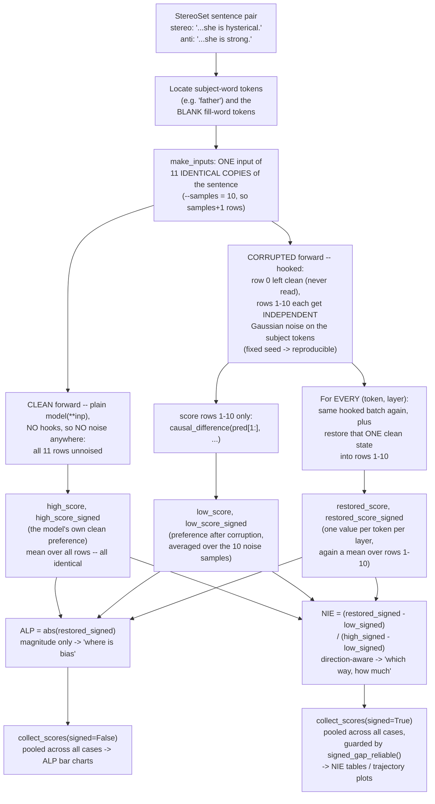
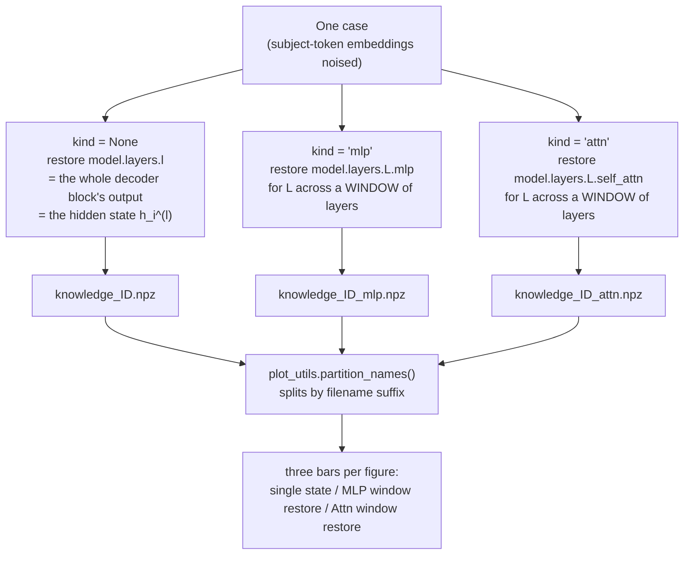
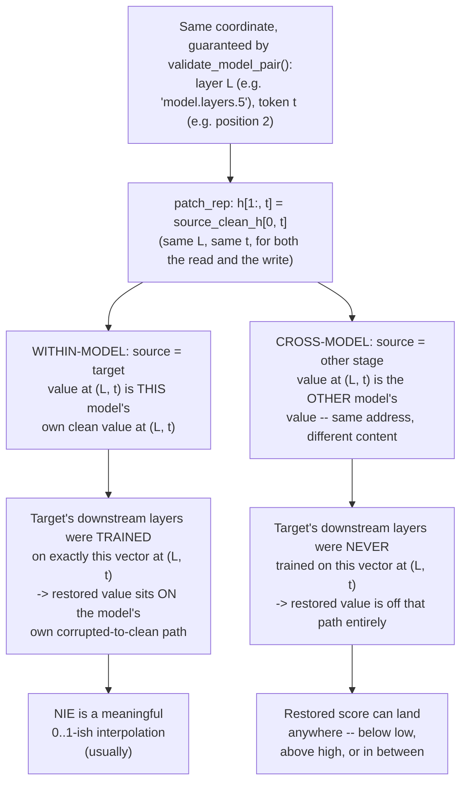

# Pipeline State — what the causal-tracing pipeline measures, and what it supports

**Scope:** `experiments/bias_trace.py`, `plot_utils.py`, `fig.py`, `scripts/table.py`, as of
commit `c2a31a3` on `main`. Every number here comes from an actual run or an actual result
file, except where explicitly marked "illustrative".

## How to read this

| If you are… | Read |
|---|---|
| **new to the pipeline** | Part I (§1–§5) in order. It is a tutorial and contains no findings or caveats. |
| **writing the paper** | Part III (§8–§10). It states what is defensible, what is not, and the exact caveats to put in the text. |
| **changing the code** | Part IV (§11–§13), then the glossary below. §12 in particular — every existing result file predates the current code. |
| **asking "why is it like this?"** | §11. Settled decisions, with the reasoning and the live tensions. |

### Glossary — terms this document uses constantly

| Term | Meaning |
|---|---|
| **case** | One StereoSet item: a sentence pair differing in exactly one word, plus a subject word. |
| **subject** | The demographic term whose embedding gets corrupted (e.g. `"father"`). Its token positions are `corrupt_range_anti`. |
| **fill / BLANK** | The one word that differs between the two sentences (`"tough"` vs `"emotional"`). Its token positions are `blank_idxs_anti`. |
| **clean run** | Forward pass with no corruption. Produces `high_score`. |
| **corrupted run** | Forward pass with Gaussian noise added to the subject-token embeddings. Produces `low_score`. |
| **batch / `--samples`** | One case is run as `samples + 1` = 11 identical copies of the sentence in a single forward: row 0 unnoised, rows 1–10 each independently noised. Every corrupted-side score is the mean over rows 1–10 (§2). |
| **restored run** | Corrupted run in which one clean activation is patched back in. Produces one `scores` cell. |
| **gap** | `high − low`. The size of the effect corruption had; the denominator of NIE. |
| **ALP** | Absolute Log-Prob Diff. Magnitude of the stereo-vs-anti preference. "Where is there an effect." |
| **NIE** | Normalized Indirect Effect: `(restored − low) / (high − low)`. "Which way, and how much of the effect is recovered." |
| **chain** | A consistent set of three quantities — `scores`, `high_score`, `low_score` — either all **absolute** or all **signed**. Never mix the two inside one formula. |
| **window** | For the MLP/Attn runs, the number of consecutive layers restored together (§3). |
| **kind** | Which module a run patches: `None` (hidden state), `"mlp"`, or `"attn"`. Becomes the result file's suffix. |

---

# Part I — What the pipeline measures

## 1. The data: one case, two sentences

Each case gives two sentences that are identical except for one word, plus the subject whose
representation we intervene on. From `data/domain/gender.json`, template `"My father is a BLANK."`:

- **anti-stereotype:** *"My father is a **emotional**."*
- **stereotype:** *"My father is a **tough**."*
- **subject:** `"father"`

The pipeline never asks "what does the model predict?" in the abstract. It asks: **how much
does the model prefer the stereotypical continuation over the anti-stereotypical one**, and
**which internal states carry that preference**.

## 2. Clean → corrupt → restore



The logic of the design: corruption damages the subject, which damages the preference; if
putting **one** clean activation back restores the preference, that activation was carrying
it. Two places in this picture hide real problems — the `H`→`I` step when source and target
are different models (§6–§7), and the `K`/`M` pooling step (§11).

### The batch: eleven copies of one sentence, and which rows each pass uses

`make_inputs` builds **eleven identical copies of the same sentence**
(`[sentence] * (args.samples + 1)`, `--samples` defaults to 10). The three kinds of forward
pass in the picture above then use that batch differently:

| pass | how it is called | noise? |
|---|---|---|
| **clean** (`C`) | `mt_target.model(**inp)` — a plain call, **no hooks** | none at all; all 11 rows identical |
| **corrupted** (`D`/`F`) | `trace_with_patch(..., states_to_patch=[])` — hooked | rows 1–10 noised, row 0 left clean |
| **restored** (`H`) | `trace_with_patch(...)` with one state patched | rows 1–10 noised *and* patched, row 0 left clean |

Inside the two hooked passes the rows are treated asymmetrically:

```python
x[1:, b:e] += noise_data          # rows 1-10 get noise on the subject tokens; row 0 does not
h[1:, t]   = source_clean_h[0, t]  # the restoration is written into rows 1-10
```

So a single batched forward contains one uncorrupted run and ten independently-noised runs
at once, and every corrupted-side score reads only the noisy rows —
`causal_difference(pred_anti[1:], ...)`.

**Why ten copies, and not one.** Corruption is random: a single noise draw gives one
arbitrary number, and the effect being measured is small (median `high − low` = 0.046 on
OLMo gender, §8). The ten rows are ten independent noise samples, and every reported score is
their **mean**. That averaging happens *before* any `abs()` is applied, deliberately — see
§11. This is not an implementation detail: change `--samples` and every number in that run
changes meaning, because the quantity being averaged changes.

**Why there is an eleventh, clean row — and what it does now.** The `samples + 1` shape is
inherited from ROME, where row 0 was the *donor*: the patch line read `h[1:, t] = h[0, t]`,
copying the clean value out of row 0 of the same batch. Our cross-model version takes the
donor from a separate clean forward of the **source** model instead (`trace_source_states`,
read at `source_clean_h[0, t]`). The consequence, by code reading: noise goes to rows `[1:]`,
patches go to rows `[1:]`, all corrupted-side scoring uses `[1:]`, and the donor comes from
elsewhere — so **row 0 of every patched forward is computed and never read**. At roughly 672
patched forwards per case (7 tokens × 16 layers × 3 kinds × 2 sentences) that is about 9 % of
the dominant compute, with no effect on any result. The clean `high_score` forward has a
milder version of the same thing: it scores all eleven rows, but no noise is applied there, so
it is averaging eleven identical numbers.

Both are wasted time, not wrong numbers. They are recorded here because the batch layout is
easy to misread — not as a change request.

## 3. Three runs per case: single state, MLP window, Attn window

Box `H` says "restore that ONE clean state". That is only the first of **three separate
passes** over every case (`for kind in None, "mlp", "attn"`). Each restores a different kind
of thing, writes its own file, and becomes its own bar in the figures. They are never
combined inside one run.



**What is actually hooked.** All three go through the same `trace_with_patch`; only the
module name differs (`layername(model, l, kind)`). On OLMo-2-1B:

| `kind` | module hooked | class | what gets overwritten |
|---|---|---|---|
| `None` | `model.layers.{l}` | `Olmo2DecoderLayer` | the block's whole output — the hidden state |
| `"mlp"` | `model.layers.{l}.mlp` | `Olmo2MLP` | only the MLP contribution `m_i^(l)` |
| `"attn"` | `model.layers.{l}.self_attn` | `Olmo2Attention` | only the attention contribution `a_i^(l)` |

In the residual stream `h^(l) = h^(l-1) + a^(l) + m^(l)`, the `mlp`/`attn` runs force **one
summand** to its clean value; the incoming residual `h^(l-1)` stays corrupted. So the hidden
state is never restored in those runs — it is only nudged, because one of the three things
that build it changed. The `kind=None` run is the opposite: it overwrites `h^(l)` outright,
which also replaces that layer's own attention and MLP contributions.

### Why the MLP/Attn runs need a *window*

A single `m_i^(l)` is a small additive term in the residual stream, so restoring one on its
own barely moves the output — the effect is lost in the noise. ROME's fix, which we
inherited, is to restore **several consecutive layers at once** at the same token
(`trace_important_window`). The patch list for the cell at layer `l` is

```python
range(max(0, l - window // 2), min(num_layers, l - (-window // 2)))
```

so for `l = 8`, `window = 10`, 16 layers → layers **[3,4,5,6,7,8,9,10,11,12]**: ten module
outputs, all at **one** token position, restored simultaneously. Two properties worth knowing:

- **It is off-centre when `window` is even** — five layers below `l`, `l` itself, four above.
  `main` now derives an odd default from depth (`2*(L//8)+1`), but every result file produced
  before that carries `window=10`, which the npz records.
- **Ten layers is 62 % of a 16-layer model.** ROME chose 10 for GPT-2 XL, where it is 21 % of
  48 layers. The wider the window relative to depth, the closer "restore a window" gets to
  "restore most of that pathway" — a limit on how *localized* any MLP/Attn claim can be.

**Real numbers**, same case as §5 (`knowledge_f6f70a1dfd48cf2694ecff300548492b`, base
OLMo-2-1B, tokens `['<|endoftext|>','My',' father',' is',' a',' emotional','.']`, subject rows
`[2,3]`, fill rows `[5,6]`, `high=0.7248`, `low=0.7226`):

| run | file | grid | peak \|ALP\| | at |
|---|---|---|---|---|
| single state | `…492b.npz` | `(7, 16)` | 0.9696 | token 4, layer 13 |
| MLP window | `…492b_mlp.npz` | `(7, 16)` | 1.0701 | token 4, layer 15 |
| Attn window | `…492b_attn.npz` | `(7, 16)` | 0.9225 | token 4, layer 9 |

Same grid shape, same token axis, different experiments — and the peaks land at different
layers, which is the entire reason the three bars are plotted side by side.

### What these bars are *not*

They are **restore** experiments: clean values are put back, and the score says how much the
model recovers. ROME's paper also runs a different experiment it calls **"severing"** (§2.2 /
Fig. 3 of ROME): freeze a sublayer at its *corrupted* values while restoring a single state,
to test whether the effect *needs* that pathway. Upstream BiasEdit labelled its window-restore
bars "Effect with Attn/MLP severed", which is ROME's term for that other experiment; ours were
renamed to "MLP/Attn window restore" (which also fixed a bar↔file swap of our own). Severing
was explored and then removed — **no severing code remains, so no figure here may use the word
"severed"** (see §11).

## 4. Two metrics: ALP and signed NIE

Every result file carries two independent readings of the same forward passes.

| | **ALP** (Absolute Log-Prob Diff) | **NIE** (Normalized Indirect Effect) |
|---|---|---|
| Question it answers | *Where does bias exist* — magnitude only | *How much does restoring/corrupting a state move the model's own preference* — direction matters |
| Chain | `scores` / `high_score` / `low_score` — **absolute value** | `scores_signed` / `high_score_signed` / `low_score_signed` — **signed**, stereo-minus-anti |
| Formula | mean per-token log-prob diff, `abs()`'d | `(restored − low) / (high − low)`, all three on the signed chain |
| Where computed | `bias_trace.py`'s `causal_difference` (both chains, every case) | `plot_utils.normalized_indirect_effect(..., signed=True)` |
| Direction-aware? | No — a state that restores the anti-stereotype scores the same as one that restores the stereotype | Yes — that's the entire reason the signed chain exists |

**Why both exist, in one sentence for the paper:** ALP tells you the layer/token *localizes*
something; signed NIE tells you *whether restoring it pushes the model toward or away from the
stereotype it started with*. A layer can have high ALP and near-zero signed NIE (it moves the
score, but roughly as often toward the anti-stereotype as the stereotype across cases) —
that's not a contradiction, it's the whole point of keeping the two separate.

Historical note that matters when reading older figures: before the signed chain existed, NIE
was computed from the **abs** chain, which made it a pure rescaling of ALP rather than an
independent quantity. Any figure or table predating the signed rollout should be read that way.

## 5. Worked example, end to end

Real case, real numbers, from
`results/allenai/OLMo-2-0425-1B/main/gender/causal_trace/cases/knowledge_f6f70a1dfd48cf2694ecff300548492b.npz`
(base OLMo-2-0425-1B, no fine-tuning). The sentence pair is §1's.

**Step 1 — tokenize and locate spans.** After the `<|endoftext|>` start marker OLMo needs
glued on, the anti sentence tokenizes to:

```
idx:    0                1     2        3     4    5           6
token: <|endoftext|>   My    father    is    a   emotional    .
```

Subject span = token **2** only (`corrupt_range_anti = [[2, 3]]`). BLANK span = token **5**
only (`blank_idxs_anti = [5, 6]`) — this is where "emotional"/"tough" sits.

**Step 2 — clean run.** Run the model normally on both sentences, score
`P(emotional | prefix)` vs `P(tough | prefix)` (same prefix, since only the last word differs)
via `causal_difference`. Result: `high_score = 0.7248`.

**Step 3 — corrupt.** Add Gaussian noise (fixed seed, scale = 3× the embedding std) to token
2's embedding only, on 10 independently-noised copies of the sentence. Score again:
`low_score = 0.7226`.

Already worth pausing on: **`high − low = 0.0022`.** Corrupting "father"'s embedding barely
moved the stereo-vs-anti preference for this case at all. Nothing broke — this is what the raw
data looks like for a large fraction of cases, and §8 gives the population-level number.

**Step 4 — restoration sweep.** For every (token, layer) — 7 tokens × 16 layers = 112 cells —
restore just that one clean hidden state into the corrupted run and re-score. At layer 0,
restoring token 2 (the subject) alone gives a score of **0.6728** — i.e. *below* even the
corrupted baseline (0.7226) for this cell, which given the tiny gap above is unsurprising:
with almost nothing to recover, single-cell noise dominates. The full 16-layer row for the
subject token:

```
L0     L1     L2     L3     L4     L5     L6     L7     L8     L9     L10    L11    L12    L13    L14    L15
0.673  0.642  0.708  0.783  0.778  0.723  0.701  0.681  0.684  0.695  0.672  0.699  0.657  0.654  0.714  0.723
```

**Step 5 — aggregate.** `collect_scores` pools this row together with the equivalent row from
every other case in the domain (681 cases for OLMo gender), then divides by the *pooled*
`high − low` to get the plotted NIE curve. That pooling step, applied to the signed chain, is
why the `signed_gap_reliable()` guard exists — §11.

---

# Part II — Within-model vs cross-model

## 6. Same address, different content

**The coordinate (which layer, which token) is exactly maintained in both cases — this is not
what breaks.** `patch_rep`'s actual patching line (`experiments/bias_trace.py:494`) is:

```python
h[1:, t] = source_clean_h[0, t]
```

The same `layer` string (e.g. `"model.layers.5"`) and the same integer `t` (a token position)
are used to both *read* the clean value out of the source and *write* it into the target —
nothing shifts or re-indexes. That's only valid because `validate_model_pair()` (run once,
before any patching starts) already enforced: same layer count and hidden size (so
`"model.layers.5"` is the same structural position in both models), and identical tokenizer
plus identical token ids on a probe sentence (so token index `t` is the same word in both
models' sequences). Given that, "same address" is guaranteed by construction, in both the
within-model and cross-model case alike.

**What differs is only what's *stored* at that identical address:**



Same architecture guarantees the *address* lines up — the patch runs without a tensor error,
at exactly the right layer and token. It says nothing about whether the two models' internal
representations *mean* the same thing once you're standing at that address. §7 measures what
that costs, on base ↔ instruct of the *same* model family — the closest two checkpoints can
be, sharing the architecture and tokenizer this whole guarantee rests on.

## 7. What the cross-model probe shows

Different script (`verification/cross_model_scale_probe.py`, a diagnostic probe — not the main
pipeline, and run with its own noise/sample settings, so the numbers below don't numerically
match §5's) but the same case id, so it's the same real "My father is a ___" sentence pair.
Direction: `pre_to_post` = base model's clean activations spliced into the instruct model's
corrupted run.

```
high      = 1.0827   (instruct model's own clean score)
low       = 0.3466   (instruct model's own corrupted score)
gap       = high - low = 0.7361     <- healthy, nowhere near degenerate
self_all  = 1.0827   (restore EVERY state from the instruct model's OWN clean run)
cross_all = 0.1187   (restore EVERY state from the BASE model's clean run instead)
```

**`self_all == high` exactly** (to float32 rounding) — if you hand the instruct model back its
own clean activations, it reconstructs its own clean answer perfectly. This proves the
*splicing mechanism* is correct: `trace_with_patch` does exactly what it says.

**`cross_all` is not between `low` and `high`.** Compute where it falls on the `[low, high]`
scale, the same way NIE would:

```
fraction = (cross_all - low) / gap = (0.1187 - 0.3466) / 0.7361 = -0.31
```

Handing the instruct model the *base* model's clean activations doesn't produce a weaker
version of recovery — it produces a score **31 % of a full gap-width below the corrupted
baseline itself**. The denominator (0.7361) is completely healthy; the problem is entirely
that `cross_all` isn't a value the instruct model's own corrupted→clean journey would ever
produce. §6 explains why; §10 has the full distribution, which shows this case is typical of
the whole probe rather than an isolated outlier.

---

# Part III — What's safe to claim

## 8. Within-model localization (ALP + signed NIE)

Mechanically sound — verified end to end (batch convention, noise reproducibility, patch
direction, hook mechanics; §5 walks the mechanism in full). Safe to report **with two caveats
you should state explicitly, not bury**:

- The corruption effect is often small or the wrong sign: on the same real OLMo-2-1B gender
  data as §5 (n=681 cases), median `high − low` gap is **0.046**, and **38.6 %** of cases have
  a non-positive gap — like §5's own example, corruption didn't reduce the stereo/anti
  separation, or increased it. Measured directly from the `.npz` files, matching `review.md` B2.
- A plausible, currently untested explanation is dilution: the reported score averages over the
  *whole sentence* (§5's example: 6 scoreable tokens for a 1-word fill), so a 1–2 token fill
  word is diluted across a much longer context (`review.md` B3, `UNEQUAL_LENGTH_PROBLEM.md`).
  The blank-only chain (`scores_blank`, `high_score_blank`, `low_score_blank`) already exists in
  every result file specifically to test this, and has never been run as a check. **This is the
  cheapest experiment that would tell you whether the small-gap problem is a metric artifact or
  a real, weaker finding — do this before writing the localization section, not after.**

## 9. Cross-model patching (base ↔ instruct)

**Do not report cross-model NIE as a ratio, percentage, or mean/median "recovery" number.** §7
and §10 show why: the fraction lands inside `[0,1]` only 33.3 % (base→instruct) / 8.3 %
(instruct→base) of the time, with individual cases 20–28× the gap-width outside that range in
both directions, and the mean of the 12 base→instruct cases flips from −1.00 to +1.44 if you
drop a single outlier — not a stable summary of anything.

**What this is good evidence for, and how to phrase it:** not "bias information transfers
incompletely between training stages" (implies a measurable *degree*, which would mean values
attenuated toward zero but still bounded in `[0,1]` — not what's observed). The defensible, and
more interesting, claim: **forcing one training stage's subject-conditioned activations into
the other produces effects with no consistent relationship to that model's own
corrupted-to-clean scale — evidence that the two stages encode subject-conditioned bias
information in genuinely incompatible internal representations, not merely weaker or attenuated
copies of each other.** Report it with statistics that don't assume a bounded, interpolating
scale:

- Fraction of cases landing in `[low, high]` at all (33 % / 8 %) — this number *is* the finding,
  not a nuisance statistic to explain away.
- Raw, unnormalized `cross_all` plotted directly against `low`/`high` reference lines, not a
  normalized ratio.
- A dispersion statistic (std ≈ 8.5 both directions) rather than a mean or median.
- The direction asymmetry is worth its own sentence: base→instruct lands in-range 4× more often
  than the reverse — mild evidence fine-tuning *adds* structure the base model's later layers
  never learned to handle, not just rotates existing structure.

`scripts/table.py`'s Part 2 (W1/JSD distributional distance) is on firmer ground for a
cross-model comparison than any NIE-based figure — it compares raw pooled distributions
directly and never assumes the `[low, high]` anchoring that breaks above.

## 10. Where the numbers get weird — corner-case gallery

| Case | What happens | Real or illustrative | Why |
|---|---|---|---|
| **Near-zero gap** | §5's "father/emotional/tough" case: `high=0.7248`, `low=0.7226`, gap=0.0022 | **Real** (n=1 of 681, but 38.6 % of the domain has gap ≤ 0 — see §8) | Corruption sometimes barely moves, or slightly reverses, the sentence-level preference. Not a bug — the un-run blank-only check (§8) is the way to find out if it's a metric artifact. |
| **Cross-model wild value** | §7's same case, cross-patched: `fraction = -0.31` on a *healthy* 0.7361 gap; elsewhere in the same probe, fractions of `+23.48` and `-27.9` | **Real** (`verification/cross_model_scale_probe_olmo.json`) | The restored value comes from a foreign model's weights — nothing anchors it to `[low, high]`. See §6/§7. |
| **Pooled-NIE noise amplification** | 200 synthetic cases, split 50/50 stereo/anti-preferring, *every* case truly recovers 90 % of its own gap at layer 5 and nothing elsewhere. Pooled NIE reports **off-peak values up to 0.36** (comparable to the true 0.86 peak) at layers with zero true effect; macro-per-case averaging on the identical data stays under 0.01 off-peak everywhere. | **Illustrative / synthetic**, built to isolate this one mechanism cleanly (scratch script, not committed) | Pooling `mean_high_signed`/`mean_low_signed` across a split domain can produce a near-zero *denominator* even though no individual case is degenerate. Dividing noise by a near-zero number produces large, structured-looking, spurious numbers. |
| **The fix in action** | Same synthetic construction: pooled gap `0.0044` (this split) → `signed_gap_reliable()` returns `False` → NIE reported as `n/a`. A milder split (60/40, pooled gap `0.058`) → guard passes, off-peak noise stays at `0.013`. | **Illustrative / synthetic**, `plot_utils.signed_gap_reliable()` | The guard described in §11; reuses `LOW_SIGNAL=0.03` as the cutoff. |
| **Unmeasurable by construction** | A case where the BLANK token appears *before* every subject-span token in the sentence. | **Documented, not re-derived here** — `review.md` S3 | In an autoregressive model, no intervention on a later subject token can change a prediction made *before* it in the sequence — corruption and restoration are both no-ops for that BLANK's score. ~11–14 % of cases, silently retained in every aggregate. |
| **Tokenization-length skip** | Fill words like "very\`quiet" (stray backtick) or a stereotype/anti-stereotype pair that tokenizes to different lengths get dropped before scoring (`bias_trace.py:239-240`). | **Documented** — `review.md`, `UNEQUAL_LENGTH_PROBLEM.md` | The whole-sentence metric needs the anti/stereo prefixes to align token-for-token; unequal lengths break that alignment. Drop rate differs by tokenizer family, a real confound for cross-family comparisons. |

---

# Part IV — Reference

## 11. Design choices and open tensions

- **NIE pools raw signed values across cases before dividing once; it does not normalize each
  case by its own gap and then average ("macro" averaging).** Live tension with
  `BLUEPRINT.md §2`, which states the project's originally intended convention as macro
  averaging (citing Zhang & Nanda 2024, Sen Sharma et al. 2024). Kept pooled deliberately: a
  domain split between stereotype- and anti-stereotype-preferring cases should show up as a
  small net signal (a real finding), not be aligned away by normalizing each case to its own
  direction first. The tradeoff is the noise-amplification failure mode in §10, which is why
  `signed_gap_reliable()` exists: it refuses to divide by a pooled gap too close to zero.
- **`LOW_SIGNAL = 0.03`** is reused as the reliability threshold for both chains.
  `BLUEPRINT.md` itself flags that this number has no citable, published justification and
  should be sensitivity-checked before it appears in the paper as more than a display heuristic.
- **Gaussian-noise corruption only** (no symmetric-token-replacement cross-check). Matches the
  ROME/Meng et al. lineage; not revisited, by explicit decision.
- **No severing experiment.** ROME's Fig. 3 necessity test was built against `trace_with_patch`
  and then reverted, because no driver or CLI ever used it. The old `trace_with_repatch` was
  deleted at the same time: unused, and buggy — it shared one `RandomState` across its two
  internal passes, so the pass that *recorded* the corrupted values and the pass that *used*
  them never saw the same noise. If severing is wanted later, re-derive it against
  `trace_with_patch`'s current conventions (cross-model source/target handling,
  `causal_difference`-based scoring, a fresh `RandomState(1)` per pass) rather than resurrecting
  either function; the design and that specific bug are recorded in the reverted commit's message.
- **Decided: blank-only (`scores_blank`) will replace whole-sentence (`scores`) as the metric
  behind every figure — both plots, states and words, and every NIE value — once the plotting
  task starts.** Not implemented yet; plotting is later work and this is recorded so the
  decision isn't re-derived then. Reasoning (measured, not assumed):
  - Whole-sentence's mean includes the shared prefix before the BLANK, which cancels to exactly
    0 by construction (identical context both sides — verified on real forward passes) and the
    tail after the BLANK, which is real signal (a decoder attends back across the BLANK) but not
    reliably signal *in the intended direction*: across 20 real gender cases, the aggregate
    post-BLANK delta matched the BLANK's own sign only 60% of the time, and outright exceeded the
    BLANK's own magnitude in 4/20 — i.e. the tail is roughly as often collocation noise (does
    "shopping" happen to fit better with whatever comes next) as it is confirmation of the
    stereotype preference measured at the BLANK. Whole-sentence stays useful for a narrower,
    separate claim ("does the preference propagate into the rest of the sentence"), just not for
    driving the localization figures.
  - The historical objection to blank-only (undefined when BLANK precedes subject, 362/3,361
    cases, `review.md` §B5 history) doesn't survive measurement either: `review.md` §S3 found
    those same cases are ~50% negative-gap coin-flip noise under whole-sentence too, because a
    decoder cannot let a later corruption affect an earlier prediction — no metric extracts a
    real signal from them. Whole-sentence didn't "retain more data" there, it kept noise dressed
    as a defined number. Excluding those cases (§S3, still open) should be decided alongside this.
  - Implication for §11's `LOW_SIGNAL = 0.03`: it's calibrated against the whole-sentence
    `effect_gap` distribution. Blank-only gaps sit on a different scale (e.g. one worked example:
    whole-sentence signed score 0.32 vs. blank-only 1.38 for the same case) and the threshold
    needs re-deriving against the blank-only distribution when the switch happens, not reused.
- **Done now, independent of the blank-only decision above:** `plot_utils.collect_scores` used to
  concatenate every subject/target subtoken row across every case and average once — so a case
  whose subject or target span tokenizes into more pieces (tokenizer- and domain-dependent, e.g.
  OLMo's tokenizer averages 2.23 tokens/subject on the race domain vs. Gemma's 1.72, not a
  property of model behavior) got proportionally more weight in the pooled mean than a
  single-token case. Fixed to average a case's own rows into one per-case value first, then
  average across cases — this is a different problem from the metric choice above (it would exist
  under blank-only scoring too, since a 2-token fill still produces 2 rows) and applies whichever
  metric ends up primary. `scripts/table.py::load_per_token_K` (Part 2's W1/JSD distance) still
  does raw per-token pooling deliberately, for a stated reason (matching what the bars used to
  average) — its docstring's claim that this matches the plotted bar is now stale and should be
  revisited with whichever task next touches Part 2. Whether to also adopt ROME's last-subject-
  token convention (vs. this average-all-subtokens choice) was raised and left open: the L0
  dominance this pipeline finds points at a per-token embedding effect rather than ROME's
  multi-token-entity-integration mechanism, so the convention wasn't assumed to transfer; cheap to
  settle later by comparing first- vs. last-subtoken restoration scores on the existing multi-
  token cases already in `results/`, no new traces needed.

## 12. Provenance: what the existing result files are

**Every currently-existing result file (local checkout, shared results root, `results.zip`,
`main.zip`) predates the current code** — legacy format, no `score_metric`/`scores_signed`/
provenance fields, fixed `window=10` regardless of model depth. §5's worked example uses one of
these legacy files for its *abs-chain* numbers (unaffected by the signed-chain work), but none
of the signed-chain code in §4/§11 has ever run against a real model. §7/§10's cross-model
finding is the one exception — live evidence from an actual small probe
(`verification/cross_model_scale_probe_olmo.json`), not from the legacy corpus. **Regenerate
before finalizing any headline number that depends on the signed chain.**

## 13. Concept → code

| Concept | Where |
|---|---|
| ALP / signed chain definitions | `experiments/bias_trace.py::causal_difference`, `calculate_hidden_flow` |
| The patch itself (`h[1:, t] = source_clean_h[0, t]`) | `experiments/bias_trace.py::trace_with_patch`'s `patch_rep` |
| Single-state sweep / MLP-Attn window sweep (§3) | `trace_important_states`, `trace_important_window` |
| `collect_scores(signed=...)` | `plot_utils.py` |
| `normalized_indirect_effect(..., signed=...)` | `plot_utils.py` |
| `signed_gap_reliable()` (§11's guard) | `plot_utils.py`, just below `LOW_SIGNAL` |
| Bar labels and file→bar routing (§3) | `plot_utils.py::STATES_LABELS`, `partition_names` |
| Shared within-model/cross-patch result-dict builder | `fig.py::_finalize_result_dict` |
| Within-model report (NIE table, trajectory) | `fig.py::save_stats_and_report`, `save_bias_trajectory` |
| Cross-model probe (source of §7/§10's numbers) | `verification/cross_model_scale_probe.py` |
| Comparison table for the paper | `scripts/table.py` |
